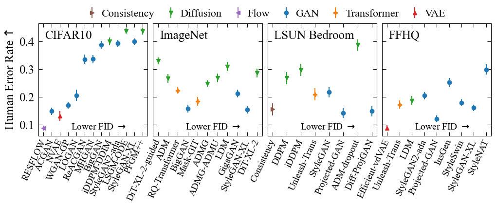
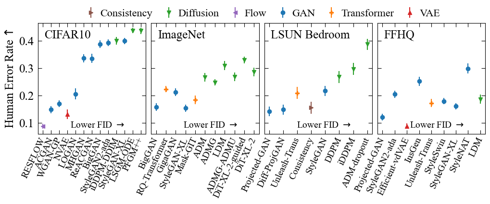
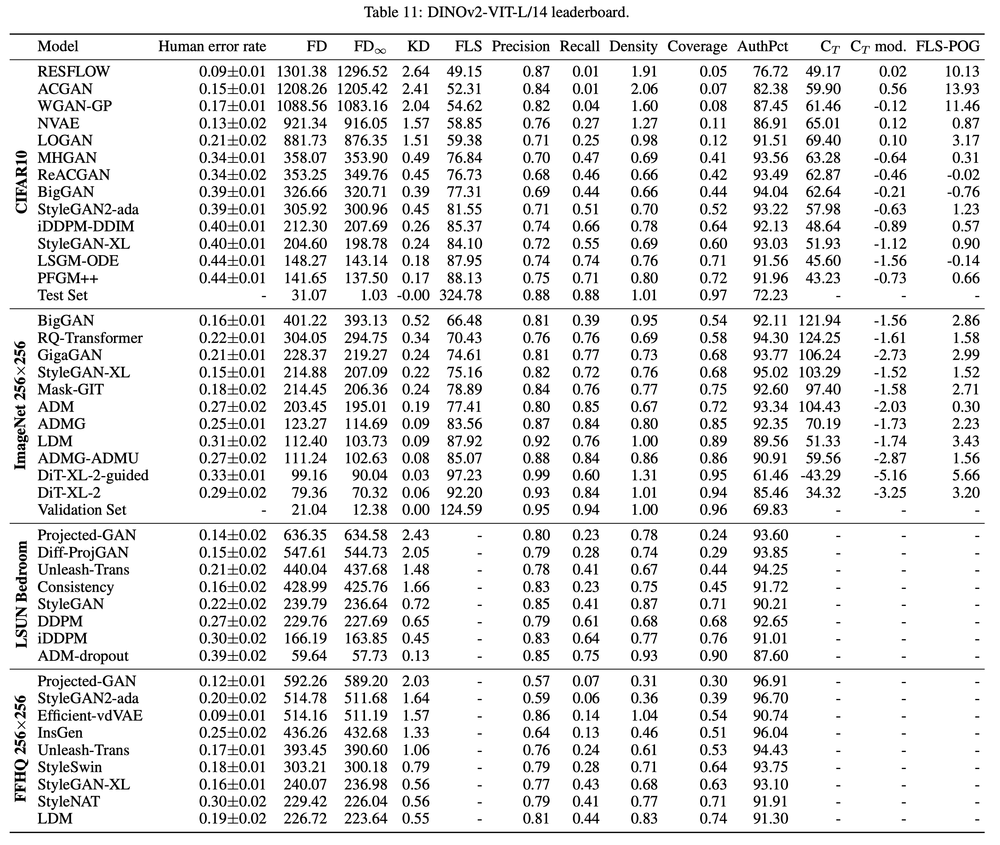
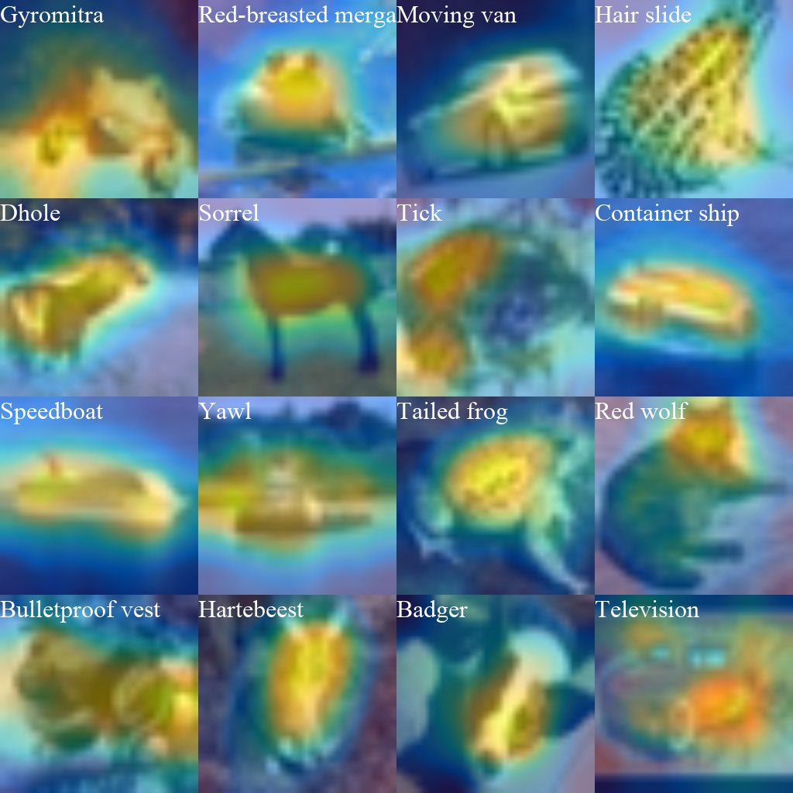
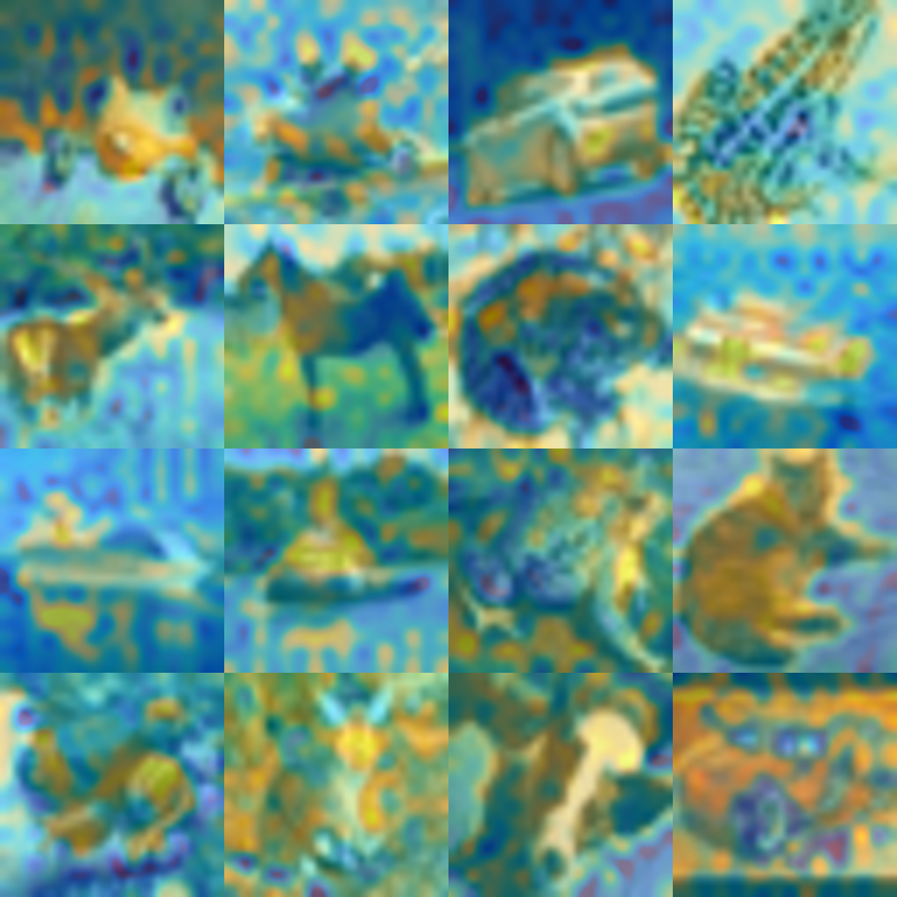

<p align="center">
<a href="https://layer6.ai/"></a>
</p>

# Evaluation of Deep Generative models

The codebase for evaluation of deep generative models as presented in [*Exposing flaws of generative model evaluation metrics and their unfair treatment of diffusion models*](https://arxiv.org/abs/2306.04675), accepted to [NeurIPS 2023](https://neurips.cc/virtual/2023/poster/73076)

We studied 41 generative models across a diverse range of image datasets and found:

* The state-of-the-art perceptual realism of diffusion models as judged by humans is not reflected in commonly reported metrics when using the default Inception-V3 network.
* Supervised networks do not provide a perceptual space that generalizes well for image evaluation, and neither do self-supervised methods from particular families.
* [DINOv2](https://github.com/facebookresearch/dinov2) provides such a generalized representation space and allows for much richer evaluation of generative models. **Researchers should replace Inception-V3 in all evaluation metrics**. We provide an extensive DINOv2 leaderboard [below](#dinov2-leaderboard) and have added the results to *paperswithcode.com*.
* Generative models directly memorize training examples on simple, smaller datasets like CIFAR10, but not necessarily on more complex datasets like ImageNet. However, our experiments show that currently proposed diagnostic metrics do not properly detect memorization.

Here we provide code to compute the following 15 generative evaluation metrics using 8 different encoder networks: 

Metrics:

- Fréchet Distance: [FD](https://arxiv.org/abs/1706.08500)
- [FD<sub>∞</sub>](https://arxiv.org/abs/1911.07023)
- Spatial FID: [sFID](https://arxiv.org/abs/2103.03841)
- [Kernel Distance](https://arxiv.org/abs/1801.01401)
- [Inception Score](https://arxiv.org/abs/1606.03498)
- [FLS](https://arxiv.org/abs/2302.04440)
- [Precision & Recall](https://arxiv.org/abs/1904.06991)
- [Density & Coverage](https://arxiv.org/abs/2002.09797)
- [Vendi score](https://arxiv.org/abs/2210.02410)
- [AuthPct](https://arxiv.org/abs/2102.08921)
- [C<sub>T</sub> score](https://arxiv.org/abs/2004.05675)
- [FLS-POG](https://arxiv.org/abs/2302.04440)
- [Realism](https://arxiv.org/abs/1904.06991)
- Approximate Sliced Wasserstein: [ASW](https://arxiv.org/abs/2106.15427)

Encoders:

- Inception
- [ConvNeXt](https://github.com/facebookresearch/ConvNeXt)
- [SimCLRv2](https://github.com/google-research/simclr)
- [SwAV](https://github.com/facebookresearch/swav/)
- [CLIP](https://github.com/mlfoundations/open_clip)
- [DINOv2](https://github.com/facebookresearch/dinov2)
- [MAE](https://github.com/facebookresearch/mae)
- [data2vec](https://ai.facebook.com/blog/ai-self-supervised-learning-data2vec/)

|  |
|:--:| 
| *Our multifaceted investigation of generative evaluation shows that diffusion models are unfairly punished by the Inception network: they synthesize more realistic images as judged by humans and their diversity more closely resembles the training data, yet are consistently ranked worse than GANs on metrics computed in Inception-V3 representation space.* |


## Installation & Usage

### Installation
First clone this repository, then navigate to the directory and pip install to install all required packages. 

```
git clone git@github.com:layer6ai-labs/dgm-eval
cd dgm-eval
pip install -e .
```

We recommend you do this in a conda environment:

```
conda create --name dgm-eval pip python==3.10
conda activate dgm-eval
git clone git@github.com:layer6ai-labs/dgm-eval
cd dgm-eval
pip install -e .
```

### Usage

Computing metrics only requires the paths to either locally hosted image datasets or torchvision.datasets. Encoders are automatically downloaded. For example, the following will compute the Fréchet distance (fd), kernel distance (kd), precision/recall/density/coverage (prdc), and the C<sub>T</sub> score (ct) using DINOv2 (default) as the encoder. 

```
python -m dgm_eval path/to/training_dataset path/to/generated_dataset \
				--test_path path/to/test_dataset \
				--model dinov2 \
				--metrics fd kd prdc ct
```

See ```scripts/run_experiments.sh``` or run ```python dgm_eval -h``` for further details on commandline parameters. As we suggest in the paper, metrics should be reported using the default model size (DINOv2-ViT-L/14) for final leaderboard values, but tracking progress during training is a factor of 4 more efficient with DINOv2-ViT-B/14. To use this architecture instead simply add ```--arch vitb14``` as a commandline parameter.


Local datasets should either be un-conditional:

```
local/path/
	000000.png
	000001.png
	...
```

or conditional:

```
local/path/
	0/
		000000.png
		000001.png
		...
	1/
		000000.png
		000001.png
		...
	...		
```

The directory should only include image files. To download and use a dataset from torchvision.datasets, just specify the dataset and train/test string: 

```
python dgm_eval CIFAR10:train CIFAR10:test
```

A full example is as follows:

```
python -m dgm_eval CIFAR10:train CIFAR10:test \
					--model dinov2 \
					--metrics fd kd prdc \
					--device cuda \
					--batch_size 256 \
					--nsample 512 
					
									
>>> ....
>>> Num real: 512 Num fake: 512
>>> fd: 862.53745
>>> kd_value: 0.01095
>>> kd_variance: 0.00000
>>> precision: 0.90430
>>> recall: 0.91797
>>> density: 0.97969
>>> coverage: 0.94141
```

## Data Access

### Images
All generated data shown in this work can be accessed at the following link: 

[drive.google.com/drive/folders/1X0MFaUta90d3zF9xG4KchjR-8SE0cT_7?usp=sharing](https://drive.google.com/drive/folders/1X0MFaUta90d3zF9xG4KchjR-8SE0cT_7?usp=sharing)

Including:

* Datasets of 100,000 image samples from 41 generative models across ```CIFAR10/```, ```imagenet256/```, ```LSUN Bedroom/```, and ```FFHQ256/```.
* Training & test data at 256 x 256 resolution
* Generated datasets for controlled experiments presented in the Appendix can be found in ```toy-datasets/```

### Human Evaluation

Data for human evaluation of image realism can be found at ```data/human-evaluation-realism/```


## Dinov2 Leaderboard

|  |
|:--:| 
| *DINOv2 is the best suited model for generative evaluation. Our extensive quantitative and qualitative assessments showed that it distills a generalized representation space suitable for evaluation of diverse image datasets. Metrics computed in DINOv2 space show much better alignment with human evaluation than those in Inception-V3 space.* |

We have included leaderboard values on paperswithcode (links), and list all metrics in a table below:

* [CIFAR10](https://paperswithcode.com/sota/image-generation-on-cifar-10)
* [ImageNet 256x256](https://paperswithcode.com/sota/image-generation-on-imagenet-256x256)
* [LSUN Bedroom](https://paperswithcode.com/sota/image-generation-on-lsun-bedroom-256-x-256)
* [FFHQ 256x256](https://paperswithcode.com/sota/image-generation-on-ffhq-256-x-256)




## Visualizing Heatmaps

Heatmaps can be visualized for each model on any given image datasets by the following, with examples following:

```
python -m dgm_eval CIFAR10:train CIFAR10:test \
					 --model inception \
					 --metrics fd \
					 --device cuda \
					 --batch_size 256 \
					 --nsample 50000 \
					 --heatmaps
```

Images             |  Inception | DINOv2 | 
:---:|:---:| :---:| 
 |  |  

## Citing

If you use any part of this repository in your research, please cite the associated paper with the following bibtex entry:

Authors: George Stein, Jesse C. Cresswell, Rasa Hosseinzadeh, Yi Sui, Brendan Leigh Ross, Valentin Villecroze, Zhaoyan Liu, Anthony L. Caterini, J. Eric T. Taylor, Gabriel Loaiza-Ganem

```
@inproceedings{stein2023exposing,
  title={Exposing flaws of generative model evaluation metrics and their unfair treatment of diffusion models},
  author={Stein, George and Cresswell, Jesse and Hosseinzadeh, Rasa and Sui, Yi and Ross, Brendan and Villecroze, Valentin and Liu, Zhaoyan and Caterini, Anthony L and Taylor, Eric and Loaiza-Ganem, Gabriel},
  booktitle={Advances in Neural Information Processing Systems},
  volume={36},
  year={2023}
}
```

## License

This data and code is licensed under the MIT License, copyright by Layer 6 AI.


